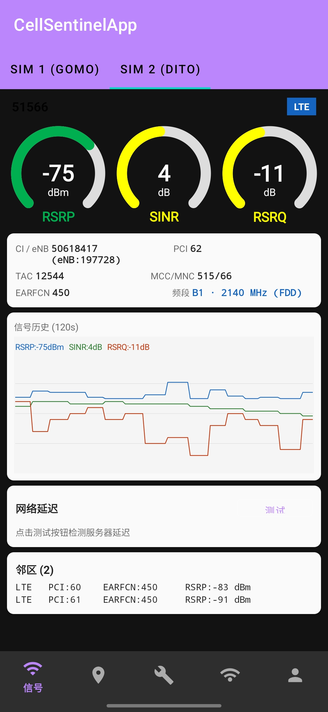
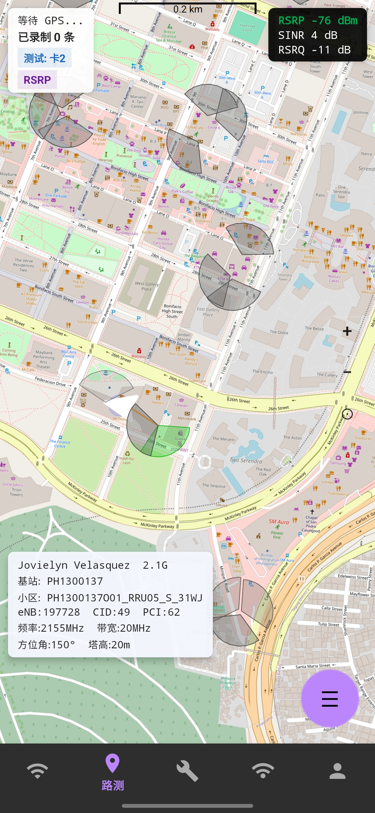
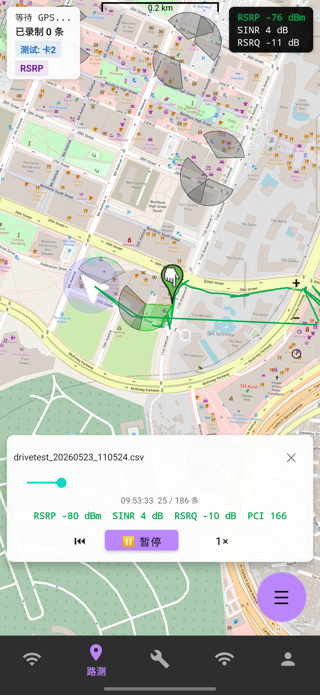
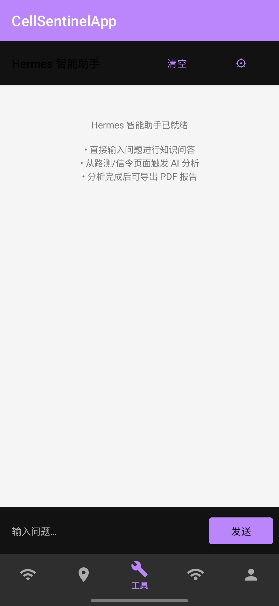

# CellSentinelApp

## 涓枃璇存槑

CellSentinelApp 鏄竴娆鹃潰鍚?Android 璁惧鐨勮渹绐濈綉缁滅洃娴嬨€佽矾娴嬪拰鐜板満鎺掗殰宸ュ叿銆傚畠鍙互璇诲彇鎵嬫満褰撳墠鐨勭Щ鍔ㄧ綉缁滅姸鎬侊紝灞曠ず LTE / 5G NR / WCDMA / GSM 绛夌綉缁滅殑鍏抽敭鏃犵嚎鎸囨爣锛屽苟缁撳悎鍦板浘銆丟PS銆乄i-Fi銆佹祴閫熷拰鏃ュ織鑳藉姏锛屽府鍔╃敤鎴疯瀵熺綉缁滆鐩栥€佷俊鍙疯川閲忓拰绉诲姩杩囩▼涓殑缃戠粶鍙樺寲銆?
### 涓昏鍔熻兘

- 瀹炴椂铚傜獫淇″彿鐩戞祴锛氬睍绀?RSRP銆丷SRQ銆丼INR銆丳CI銆丆I銆乀AC銆丮CC/MNC銆丒ARFCN/NRARFCN銆侀娈电瓑淇℃伅銆?- 澶?SIM 鍗℃敮鎸侊細鏍规嵁璁惧鑳藉姏灞曠ず涓嶅悓 SIM 鍗＄殑缃戠粶涓庝俊鍙锋暟鎹€?- 
- 璺祴璁板綍锛氬熀浜?GPS 璁板綍绉诲姩杞ㄨ抗鍜屼俊鍙烽噰鏍风偣锛屾敮鎸佹寜 RSRP銆丼INR銆丷SRQ 杩涜棰滆壊鍒嗙骇鏄剧ず銆?- 鍦板浘灞曠ず锛氶泦鎴?osmdroid锛屾敮鎸?OSM銆丒SRI 鍗槦銆丟oogle 鍗槦銆侀珮寰峰崼鏄熺瓑鍥惧眰銆?- 
- 鏁版嵁瀵煎嚭涓庡洖鏀撅細璺祴鏁版嵁鍙鍑?CSV / KML锛屽苟鏀寔 CSV 璺祴璁板綍鍥炴斁銆?- 
- Wi-Fi 淇℃伅锛氭煡鐪嬪綋鍓嶈繛鎺ヤ俊鎭€佹壂鎻忓懆杈?Wi-Fi锛屽苟鍙湪璺祴鍦板浘涓婂彔鍔?Wi-Fi 鐐逛綅銆?- 璁惧涓庝綅缃俊鎭細鏌ョ湅 Android 璁惧銆佸畾浣嶅拰缃戠粶鐩稿叧淇℃伅銆?- 淇′护浜嬩欢鏃ュ織锛氬熀浜?Android Telephony API 璁板綍鏈嶅姟鐘舵€併€丷AT 鍙樺寲銆丳CI 鍙樺寲銆佷俊鍙峰己搴﹀彉鍖栫瓑浜嬩欢锛屽苟鏀寔 CSV 瀵煎嚭銆?- 缃戠粶娴嬮€燂細鏀寔鍏綉娴嬮€熷拰鑷畾涔夋湇鍔″櫒娴嬮€熴€?- 鏈嶅姟绔鎺ワ細鏀寔閰嶇疆涓绘湇鍔″櫒鍜屽鐢ㄦ湇鍔″櫒锛屽苟鍙笂浼犱俊鍙峰揩鐓с€佽矾娴嬭褰曠瓑鏁版嵁銆?- 鏀寔鑷畾涔夋櫤鑳戒綋鍒嗘瀽鍔熻兘锛岃兘瀵煎嚭pdf鍒嗘瀽鎶ュ憡銆?
  
  ### 鎶€鏈爤

- Android Java
- Gradle Kotlin DSL
- AndroidX AppCompat / Material Components
- OkHttp
- osmdroid
- JUnit / Espresso

### 鏋勫缓涓庤繍琛?
1. 浣跨敤 Android Studio 鎵撳紑椤圭洰鏍圭洰褰曘€?2. 绛夊緟 Gradle 鍚屾瀹屾垚銆?3. 杩炴帴 Android 璁惧鎴栧惎鍔ㄦā鎷熷櫒銆?4. 杩愯 `app` 妯″潡銆?
涔熷彲浠ヤ娇鐢ㄥ懡浠よ鏋勫缓锛?
```powershell
.\gradlew.bat assembleDebug
```

### 鏉冮檺璇存槑

搴旂敤浼氳姹備綅缃€佺數璇濈姸鎬併€佺綉缁滆闂€乄i-Fi 鐘舵€佺瓑鏉冮檺銆傝繖浜涙潈闄愮敤浜庤鍙栬渹绐濈綉缁滀俊鎭€佽褰曡矾娴嬭建杩广€佹壂鎻?Wi-Fi銆佽闂湴鍥剧摝鐗囥€佹祴閫熷拰涓婁紶鏁版嵁銆?
### 鑳藉姏杈圭晫

褰撳墠鈥滀俊浠や簨浠舵棩蹇椻€濆姛鑳借褰曠殑鏄?Android 绯荤粺鍏紑鎺ュ彛鍙幏寰楃殑缃戠粶鐘舵€佷簨浠讹紝渚嬪鏈嶅姟鐘舵€佸彉鍖栥€丩TE/NR/UMTS/GSM 绛夌綉缁滅被鍨嬪彉鍖栥€佸熀浜?PCI 鍙樺寲鎺ㄦ柇鐨勫垏鎹簨浠讹紝浠ュ強 RSRP 鍙樺寲浜嬩欢銆傚畠涓嶆槸 LTE/NR 鍗忚鏍堜俊浠よВ鏋愬櫒锛屼笉鑳借В鏋愬畬鏁寸殑 RRC銆丯AS銆丮AC銆丷LC銆丳DCP 鎴栧熀甯﹀師濮嬩俊浠ゆ秷鎭€?
濡傞渶瀹屾暣 LTE/NR 淇′护鍒嗘瀽锛岄€氬父闇€瑕佸伐绋嬫満銆乺oot/鍘傚晢鏉冮檺銆丵ualcomm DIAG/QXDM/QCAT銆乵odem log銆丷adio HAL/vendor 绉佹湁鎺ュ彛锛屾垨鍩虹珯渚?娴嬭瘯浠〃鏃ュ織绛夋洿搴曞眰鐨勬暟鎹簮銆?
## English

CellSentinelApp is an Android field tool for cellular network monitoring, drive testing, and on-site troubleshooting. It reads the current mobile network state from the device, displays key radio metrics for LTE, 5G NR, WCDMA, and GSM, and combines maps, GPS, Wi-Fi, speed tests, and logs to help users understand coverage, signal quality, and network changes while moving.

### Features

- Real-time cellular signal monitoring: RSRP, RSRQ, SINR, PCI, CI, TAC, MCC/MNC, EARFCN/NRARFCN, band information, and more.
- Multi-SIM support: displays signal and network data for supported SIM cards.
- Drive testing: records GPS tracks and signal samples, with color grading by RSRP, SINR, or RSRQ.
- Map view: powered by osmdroid, with OSM, ESRI satellite, Google satellite, and Amap satellite layers.
- Export and playback: export drive-test records to CSV / KML and replay CSV records on the map.
- Wi-Fi tools: view current Wi-Fi details, scan nearby access points, and overlay Wi-Fi markers on the drive-test map.
- Device and location panels: inspect Android device, location, and network information.
- Signaling event log: records service state changes, RAT changes, PCI-change based handover hints, and signal-strength changes through Android Telephony APIs, with CSV export.
- Speed test: supports public Cloudflare speed testing and custom server testing.
- Server integration: configurable primary and backup server URLs for uploading signal snapshots and drive-test records.

### Tech Stack

- Android Java
- Gradle Kotlin DSL
- AndroidX AppCompat / Material Components
- OkHttp
- osmdroid
- JUnit / Espresso

### Build And Run

1. Open the project root in Android Studio.
2. Wait for Gradle sync to finish.
3. Connect an Android device or start an emulator.
4. Run the `app` module.

Command-line debug build:

```powershell
.\gradlew.bat assembleDebug
```

### Permissions

The app requests location, phone state, internet, and Wi-Fi permissions. These permissions are used to read cellular network data, record drive-test tracks, scan Wi-Fi, access map tiles, run speed tests, and upload data.

### Capability Boundary

The current signaling event log records network-state events exposed by Android public APIs, such as service state changes, LTE/NR/UMTS/GSM network type changes, handover hints inferred from PCI changes, and RSRP changes. It is not a full LTE/NR protocol signaling decoder and does not parse complete RRC, NAS, MAC, RLC, PDCP, or raw modem signaling messages.

Full LTE/NR signaling analysis usually requires lower-level data sources such as engineering devices, root/vendor privileges, Qualcomm DIAG/QXDM/QCAT, modem logs, Radio HAL/vendor private interfaces, or base-station/test-equipment logs.

## 鑱旂郴浣滆€?/ Contact

寰俊浜岀淮鐮?/ WeChat QR Code:


## 寮€婧愬０鏄?/ Open Source Notice

鏈」鐩噰鐢?Apache License 2.0 寮€婧愩€備换浣曚汉閮藉彲浠ヨ嚜鐢变娇鐢ㄣ€佸鍒躲€佷慨鏀广€佸垎鍙戝拰鐢ㄤ簬瀛︿範銆佺爺绌舵垨鍟嗕笟鍦烘櫙锛屼絾璇烽伒瀹堜粨搴撲腑鐨?`LICENSE` 鏂囦欢銆?
This project is open source under the Apache License 2.0. Anyone may use, copy, modify, distribute, and apply it for learning, research, or commercial purposes, subject to the `LICENSE` file in this repository.


